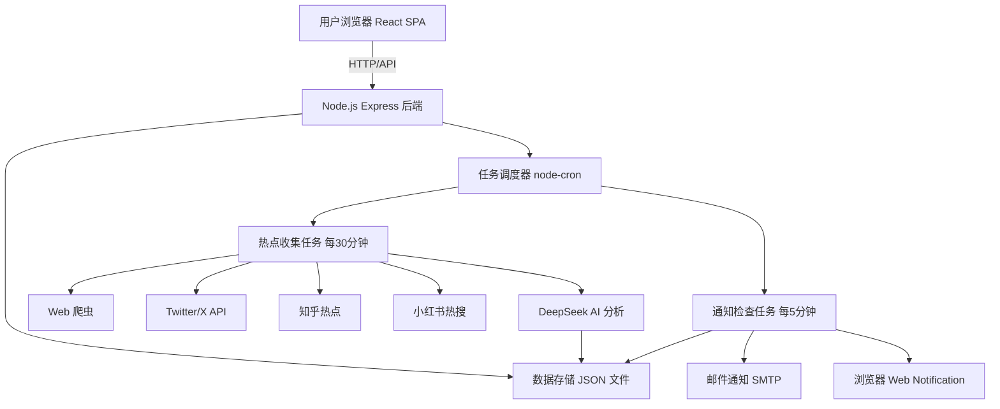

# 📋 热点监控系统 - 方案与待办清单

> 本文件是项目的**单一事实来源**（Single Source of Truth），汇总系统方案、架构、完成状态与所有待办事项。任何阶段性的开发决策都应回填到此文档。

**最后更新：** 2026-08-15

---

## 一、项目概览

**目标：** 构建一个实时热点监控系统，集成 AI 识别、多源数据爬虫、多渠道通知。

**产品形态：** 响应式 Web 应用（React + Node.js）+ 可复用的 Agent Skills 套件。

**核心价值主张：**
- 🔍 **发现** - 从多个信息源实时发现热点
- 🧠 **识别** - 用 AI 过滤虚假热点、评估相关性
- 🔔 **通知** - 热点命中关键词时多渠道即时告警

---

## 二、系统架构



### 数据流（完整管线）

```
用户添加关键词
    ↓
任务调度器（每30分钟 或 手动"立即检查"）
    ↓
多源并行爬取 → Web / Twitter / 知乎 / 小红书
    ↓
DeepSeek AI 分析（真实性判断 + 相关性评分 0-10）
    ↓
评分 ≥ 5 且为真实热点 → 存入 hotspots.json
    ↓
通知检查（每5分钟）
    ↓
关键词匹配 → 去重 → 生成通知 → 邮件 + 浏览器推送
```

---

## 三、技术栈

### 前端（`frontend/`）
| 技术 | 版本 | 用途 |
|-----|-----|-----|
| React | 18.2 | 组件化 UI |
| TypeScript | 5.2 | 类型安全 |
| Vite | 5.0 | 构建工具（端口 5173） |
| Tailwind CSS | 3.3 | 样式（暗黑主题 + 渐变） |
| Recharts | 2.10 | 数据可视化 |
| React Router | 6.18 | 路由（4 页面） |
| Sonner | 1.2 | Toast 通知 |
| Lucide React | 0.294 | 图标库 |

### 后端（`backend/`）
| 技术 | 版本 | 用途 |
|-----|-----|-----|
| Node.js + Express | 4.18 | API 服务（端口 3000） |
| TypeScript | 5.2 | 严格模式 |
| Axios | 1.6 | HTTP 客户端 / 爬虫 |
| Cheerio | 1.0 | HTML 解析 |
| node-cron | 3.0 | 定时任务 |
| Nodemailer | 6.9 | SMTP 邮件 |
| fs-extra | 11.2 | 文件存储 |
| uuid | 9.0 | ID 生成 |

### 外部服务
| 服务 | 状态 | 说明 |
|-----|-----|-----|
| DeepSeek API | ✅ 已配置 | AI 热点分析（`.env` 中已有 key） |
| Twitter/X API | ⚠️ 未配置 | 无 key 时使用 mock 数据 |
| SMTP 邮件 | ⚠️ 待验证 | 已填 qzlxn@qq.com，需验证连通性 |

---

## 四、✅ 已完成功能清单

### 1. 前端页面（4 个）
| 页面 | 路由 | 功能 |
|-----|-----|-----|
| 仪表盘 | `/` | 统计卡片 + 趋势图 + 分类饼图 + **立即检查按钮** + 任务状态栏 |
| 关键词 | `/keywords` | 增删改查、启停切换、分类管理 |
| 热点 | `/trending` | 实时热点流、按来源筛选、热度评分条 |
| 通知 | `/notifications` | 通知列表、已读/未读、删除 |

### 2. 前端组件 / Hooks
- `Layout.tsx` - 响应式侧边栏（移动端抽屉菜单）
- `OnboardingGuide.tsx` - 新用户 3 步引导
- `useApi.ts` - 通用 API 请求 + 定时刷新
- `useNotification.ts` - 浏览器通知封装

### 3. 后端 API（完整）
| 模块 | 端点 | 方法 |
|-----|-----|-----|
| 健康检查 | `/health` | GET |
| 任务控制 | `/tasks/status` | GET |
| 任务控制 | `/tasks/check` | POST（异步立即检查） |
| 仪表盘 | `/dashboard/stats` | GET |
| 关键词 | `/keywords` | GET / POST / PATCH / DELETE |
| 热点 | `/hotspots` | GET + 按分类/来源筛选 |
| 通知 | `/notifications` | GET / PATCH read / DELETE |

### 4. 后端服务层
| 服务 | 状态 | 说明 |
|-----|-----|-----|
| `dataStore.ts` | ✅ 完整 | JSON 持久化，热点上限 1000，通知上限 500 |
| `deepseekService.ts` | ✅ 完整 | AI 分析（真实性 + 相关性评分） |
| `webScraperService.ts` | ⚠️ 骨架 | 新闻/RSS/搜索/知乎/小红书（待实测） |
| `twitterService.ts` | ⚠️ Mock | 无 key 时返回模拟数据 |
| `notificationService.ts` | ✅ 结构 | 邮件模板 + 浏览器通知载荷 |

### 5. 任务调度器（`taskScheduler.ts`）
- ✅ 热点收集：**每 30 分钟**（可配置）
- ✅ 通知检查：每 5 分钟（可配置）
- ✅ 防重入保护（running flag）
- ✅ 手动立即检查（`runManualCheck` 异步后台执行）
- ✅ 状态查询（`getStatus` 返回运行状态/上次运行时间）

### 6. UI/UX 优化
- ✅ 可访问性（aria-label、焦点环、对比度）
- ✅ 移动端适配（抽屉菜单、响应式网格）
- ✅ 交互反馈（Toast、删除确认、加载态）
- ✅ 新用户引导流程

### 7. Agent Skills（`skills/`）
- ✅ `hotspot-keyword-monitor.md` - 关键词监控
- ✅ `hotspot-detection-engine.md` - 热点发现
- ✅ `realtime-notification-alerts.md` - 通知告警
- ✅ `README.md` - 套件总览

---

## 五、数据模型

### 关键词（keywords.json）
```ts
interface Keyword {
  id: string
  keyword: string
  category: 'general' | 'tech' | 'finance' | 'entertainment' | 'sports' | 'other'
  createdAt: string
  lastUpdated: string
  isActive: boolean
}
```

### 热点（hotspots.json）
```ts
interface Hotspot {
  id: string
  title: string
  description: string
  source: string          // Web / Twitter / Zhihu / Xiaohongshu
  category: string
  score: number           // 0-10 相关性评分
  trend: number           // 趋势变化百分比
  url: string
  timestamp: string
  keywords: string[]      // 关联关键词
}
```

### 通知（notifications.json）
```ts
interface Notification {
  id: string
  title: string
  message: string
  type: 'success' | 'warning' | 'info'
  keyword: string
  source: string
  timestamp: string
  read: boolean
}
```

---

## 六、⚠️ 未完成事项（按优先级排序）

### 🔴 P0 - 阻塞核心功能

#### 1. 多源数据爬虫模块（`webScraperService.ts`）
**现状：** 结构完整，但真实抓取存在多个问题
- ❌ **知乎热点** - 返回 `401 Authorization Required`（需登录/反爬处理）
- ❌ **小红书热搜** - 需实测（可能有反爬验证）
- ⚠️ 新浪/腾讯新闻 - 选择器可能已过时（`a.txt-box`、`a.news-box`），需验证
- ⚠️ Google/Baidu 搜索 - 可能触发反爬，需测试

**待办：**
- [ ] 为知乎 API 添加 Cookie/UA 头（或用公共热点接口替代）
- [ ] 实测并修正新闻站点选择器
- [ ] 为小红书增加反爬策略（Cookie、延迟）
- [ ] 添加请求重试 + 指数退避
- [ ] robots.txt 合规检查
- [ ] 请求节流（避免被封 IP）
- [ ] 添加更多数据源（微博热搜、B站热榜等）

#### 2. DeepSeek AI 识别引擎调优（`deepseekService.ts`）
**现状：** 服务就绪且已配置 key，但未做精度调优
- ⚠️ 默认 `model: 'deepseek-chat'`，可切换更优模型
- ⚠️ Prompt 较简单，可扩展为多轮结构化输出
- ⚠️ 未做错误恢复（JSON 解析失败时的 fallback）

**待办：**
- [ ] 真实调用验证（当前 `analyzeHotspot` 是否正常返回）
- [ ] 用样本热点做准确率基准测试
- [ ] 优化 Prompt（Few-shot 示例、分类白名单）
- [ ] JSON 解析异常兜底
- [ ] 评分阈值（当前 ≥5）根据实测调优

### 🟠 P1 - 重要功能完善

#### 3. Twitter/X API 集成（`twitterService.ts`）
**现状：** 无 key 时返回 mock 数据，真实 API 未测
**待办：**
- [ ] 获取 Twitter API Bearer Token（需开发者账户审核）
- [ ] 实测 `/tweets/search/recent`
- [ ] 实测 `/trends/place`（热搜标签）
- [ ] 处理 API 配额和限流
- [ ] 错误降级逻辑验证

#### 4. Web Notifications（浏览器通知）
**现状：** `useNotification.ts` hook 已建，任务调度器中已生成通知数据，但**未接入浏览器实际推送**
**待办：**
- [ ] 在通知检查处调用 `sendNotification()` 实际推送
- [ ] 权限请求流程（首次访问自动请求）
- [ ] 多浏览器兼容测试（Chrome/Edge/Firefox）
- [ ] 通知点击行为（打开对应热点）
- [ ] 通知聚合（避免轰炸）

#### 5. 邮件通知系统（SMTP）
**现状：** `notificationService.ts` 邮件模板完整，`.env` 已填 `qzlxn@qq.com`，但**任务调度器中发送调用被注释**
**待办：**
- [ ] 验证腾讯企业邮箱 SMTP 连通性（`smtp.exmail.qq.com:465`）
- [ ] 取消 `checkNotifications()` 中发送调用的注释
- [ ] 发送失败重试 + 失败日志
- [ ] 邮件模板按通知类型定制（success/warning/info）

### 🟡 P2 - 体验与质量优化

#### 6. 前端数据连接与空状态
- [ ] Trending 页面的真实数据连接验证（当前可能有 mock 图表数据）
- [ ] Dashboard 趋势图接入真实历史数据（目前是静态 5 点）
- [ ] 各页面 Loading 骨架屏
- [ ] 热点/通知空状态设计
- [ ] 页面切换过渡动画

#### 7. 测试与稳定性
- [ ] 后端单元测试（Jest/Vitest）
- [ ] API 集成测试
- [ ] 定时任务并发/防重入压力测试
- [ ] 数据文件并发写入保护（fs-extra 原子写）

#### 8. 生产部署
- [ ] Docker 容器化（前端 + 后端 + 数据卷）
- [ ] nginx 反代 + HTTPS
- [ ] 环境变量管理（生产 key）
- [ ] 数据备份策略
- [ ] PM2 进程守护

---

## 七、实现状态速查表

| 模块 | 结构 | 真实数据 | 测试 | 备注 |
|-----|:---:|:---:|:---:|-----|
| 前端 4 页面 | ✅ | ⚠️ | ✅ | 图表部分为静态数据 |
| 后端 API | ✅ | ✅ | ✅ | 全部可访问 |
| 数据存储 | ✅ | ✅ | ✅ | JSON 文件 |
| DeepSeek AI | ✅ | ⚠️ | ❌ | key 已配，未实测 |
| Web 爬虫 | ✅ | ⚠️ | ⚠️ | 知乎 401，需修复 |
| Twitter API | ✅ | ❌ | ❌ | 用 mock |
| 邮件通知 | ✅ | ❌ | ❌ | 调用被注释 |
| 浏览器通知 | ✅ | ❌ | ❌ | hook 就绪未接入 |
| 任务调度 | ✅ | ✅ | ✅ | 30/5 分钟 cron |
| 立即检查 | ✅ | ✅ | ✅ | 异步 + 状态轮询 |
| Agent Skills | ✅ | — | — | 3 个技能文档 |

---

## 八、已知问题

| 问题 | 影响 | 状态 |
|-----|-----|-----|
| 知乎 API 返回 401 | 知乎数据源为空 | 🔴 待修复 |
| 新闻站点选择器可能过时 | 新闻抓取可能为空 | ⚠️ 待验证 |
| DeepSeek 未实测 | AI 分析未验证 | ⚠️ 待测试 |
| SMTP 连通性未验证 | 邮件可能发不出 | ⚠️ 待验证 |
| 浏览器通知未接入 | 无即时推送 | ⚠️ 待接入 |
| Dashboard 图表静态 | 趋势图非实时 | 🟡 待优化 |
| 依赖存在漏洞 | 3 moderate + 1 high | 🟡 npm audit |

---

## 九、技术债务与改进建议

1. **数据存储升级** - JSON 文件 → SQLite（better-sqlite3）或 MongoDB，解决并发写与容量
2. **日志系统** - 引入 winston/pino，替代 console.log
3. **配置管理** - 增加运行时热更新配置
4. **API 文档** - 接入 Swagger/OpenAPI 自动生成
5. **前端状态管理** - 引入 zustand 全局 store（package.json 已含依赖，未使用）
6. **监控告警** - 后端自身健康监控 + 异常告警
7. **限流与安全** - API rate-limit、CORS 白名单、请求体校验
8. **多用户支持** - 目前为单用户本地系统，多用户需加认证

---

## 十、路线图

```
阶段 1 ✅  项目初始化 + 基础功能（已全部完成）
阶段 2 🔄  多源爬虫完善 + DeepSeek 实测（P0）
阶段 3 🔄  Twitter 集成 + Web/邮件通知接入（P1）
阶段 4 ⬜  前端数据真实化 + 体验优化（P2）
阶段 5 ⬜  测试 + 生产部署（Docker/nginx）
```

### 依赖链
```
爬虫修复 (P0) ──► DeepSeek 实测 (P0) ──► 数据质量提升
                                      ──► Twitter 集成 (P1)
通知接入 (P1) ──► Web 推送 + 邮件实测
```

---

## 十一、快速参考命令

```bash
# 后端启动（端口 3000）
cd backend && npm run dev

# 前端启动（端口 5173）
cd frontend && npm run dev

# 手动立即检查
curl -X POST http://localhost:3000/tasks/check

# 查看任务状态
curl http://localhost:3000/tasks/status

# 健康检查
curl http://localhost:3000/health
```

---

*本文件将持续维护，每完成一个阶段即回填状态。*
